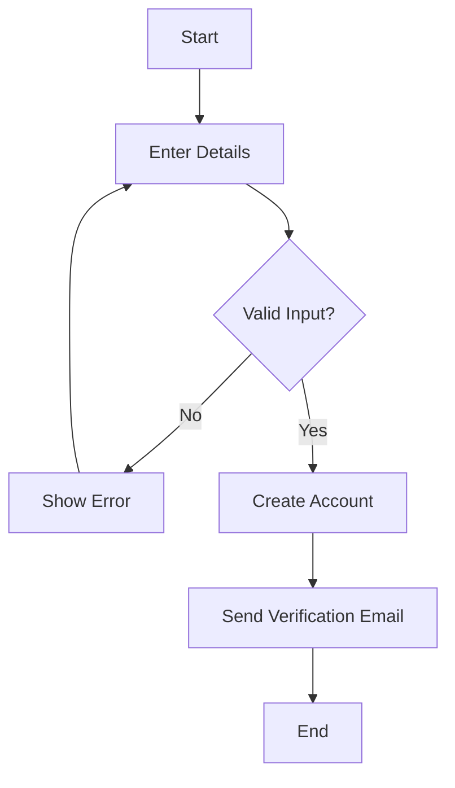
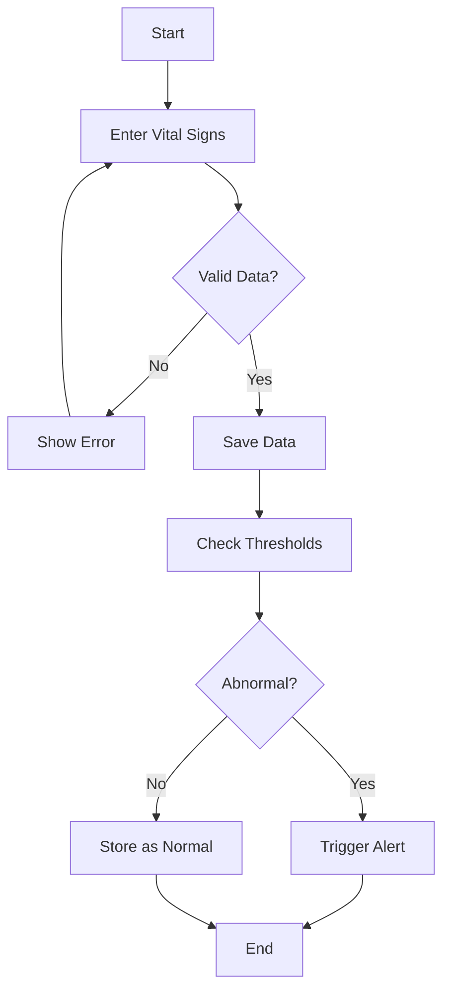
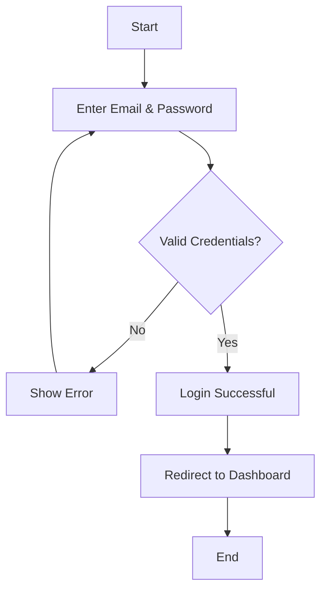
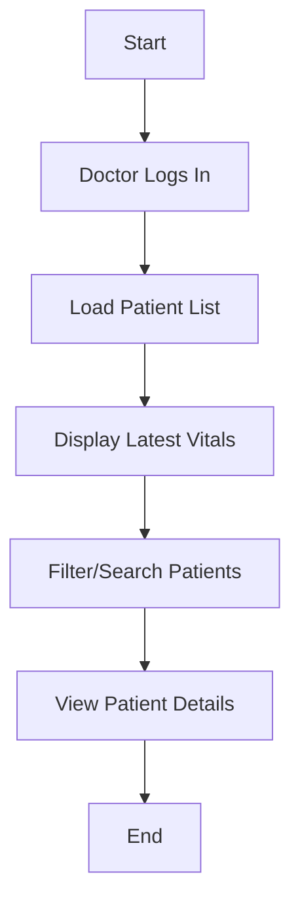
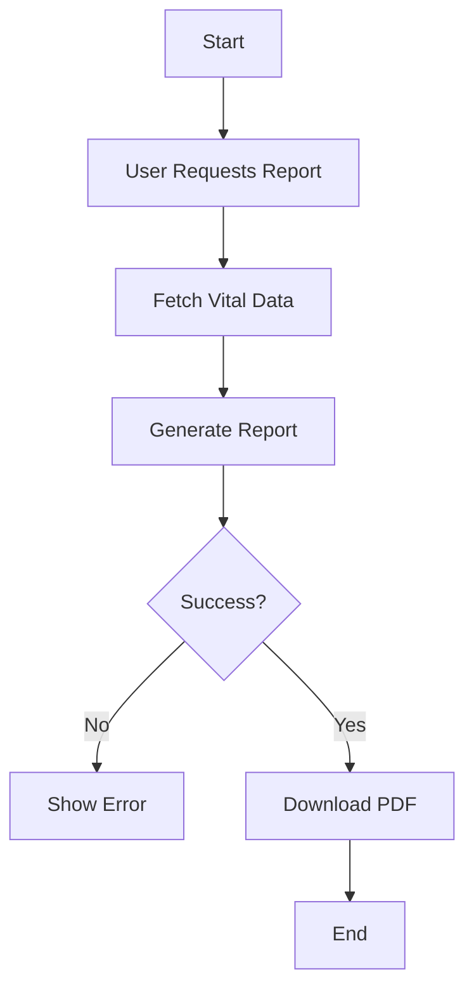
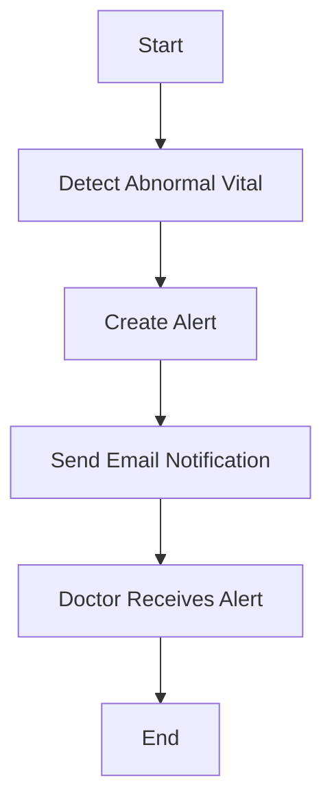
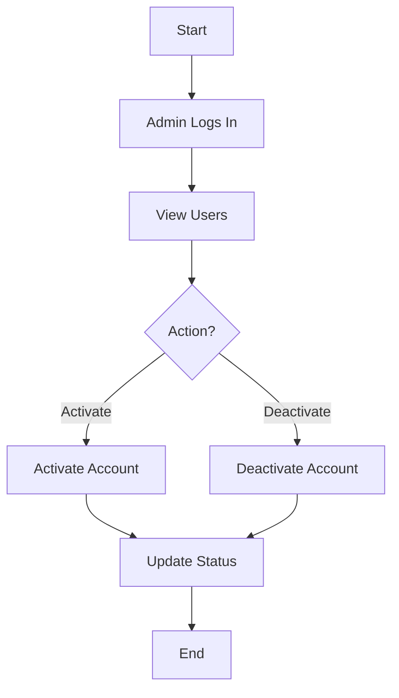
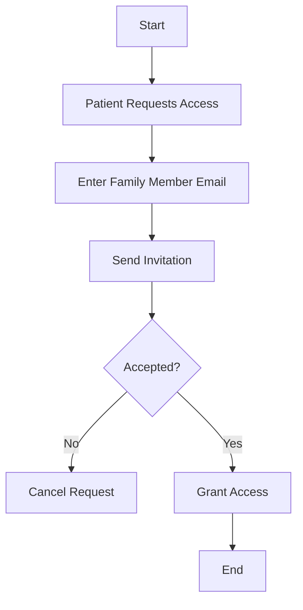

### User Registration Workflow

### User Registration Workflow Explanation

This activity diagram illustrates the process of user registration. The workflow begins when a user enters their personal details such as email and password. The system then validates the input to ensure it meets required criteria.

If the input is invalid, an error message is displayed, and the user must correct the information. If the input is valid, the system creates the account and sends a verification email.

This process ensures that only valid and properly formatted data is stored while maintaining security through email verification.

**Related Requirements:** FR-01 (Patient Registration)

### Log Vital Signs Workflow

### Log Vital Signs Workflow Explanation

This diagram shows how patients log their vital signs into the system. The process starts when the patient enters values such as blood pressure, heart rate, temperature, and weight.

The system validates the input data. If invalid values are entered, an error message is displayed. If valid, the data is saved, and the system checks whether the values exceed predefined safe thresholds.

If the readings are normal, they are stored in the database. If abnormal, the system triggers an alert and notifies the doctor.

This workflow ensures accurate data entry and enables real-time monitoring of patient health.

**Related Requirements:** FR-02 (Log Vital Signs), FR-07 (Detect Abnormal Readings), FR-08 (Send Alerts)

### User Login Workflow

### User Login Workflow Explanation
This activity diagram represents the user login process. The user enters their credentials, such as email and password, and the system validates them.

If the credentials are incorrect, an error message is displayed, and access is denied. If the credentials are correct, the user is granted access and redirected to the appropriate dashboard.

This workflow ensures that only authenticated users can access the system, supporting overall system security.

**Related Requirements:** Authentication requirements (linked to security and access control)

### Doctor Dashboard Workflow

### Explanation

This diagram illustrates how doctors interact with the system dashboard. After logging in, the doctor can view a list of assigned patients along with their latest vital readings.

The doctor can search for specific patients or filter results. Selecting a patient allows the doctor to view detailed vital trends and health data.

This workflow improves efficiency by providing quick access to important patient information and supports timely medical decision-making.

**Related Requirements:** FR-05 (Doctor Dashboard), FR-06 (View Patient Trends)

### Generate Health Report Workflow 

### Generate Health Report Workflow Explanation

This activity diagram shows how a health report is generated. The process starts when a user requests a report.

The system retrieves the relevant patient data and generates a report, typically in PDF format. If the report generation is successful, it is made available for download. If an error occurs, an error message is displayed.

This workflow enables users to track health progress over time in a structured format.

**Related Requirements:** FR-12 (Generate Health Reports)

### Send Alert Workflow

### Send Alert Workflow Explanation

This diagram represents the process of sending alerts when abnormal vital signs are detected. Once abnormal readings are identified, the system creates an alert.

The alert is then sent to the doctor via email. The doctor receives the notification and can take appropriate action.

This workflow ensures timely intervention and improves patient safety by notifying healthcare providers of critical conditions.

**Related Requirements:** FR-07 (Detect Abnormal Readings), FR-08 (Send Alerts)

### Admin Manages Users Workflow

### Admin Manages Users Workflow Explanation

This activity diagram shows how administrators manage user accounts. The admin logs into the system and views all registered users.

The admin can activate or deactivate accounts based on system policies or user behavior. These actions are recorded for audit purposes.

This workflow ensures proper system control, security, and compliance with regulations.

**Related Requirements:** FR-09 (Admin User Management)

### Grant Access to Family Member Workflow

### Grant Access to Family Member Workflow Explanation

This diagram illustrates how a patient grants access to a family member. The patient enters the family member’s email address, and the system sends an invitation.

The family member can accept or ignore the invitation. If accepted, access to the patient’s health data is granted. If declined or ignored, access is not provided.

This workflow supports controlled data sharing while maintaining patient privacy.

**Related Requirements:** FR-11 (Grant Family Access)
    

    
