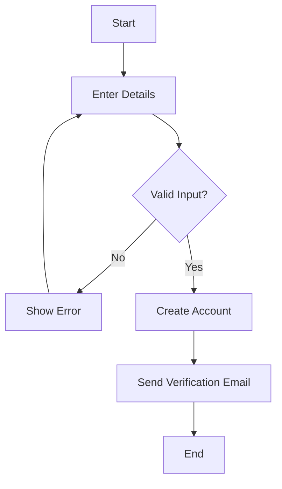
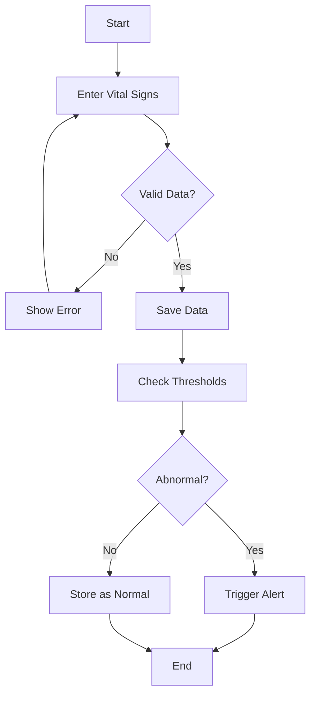
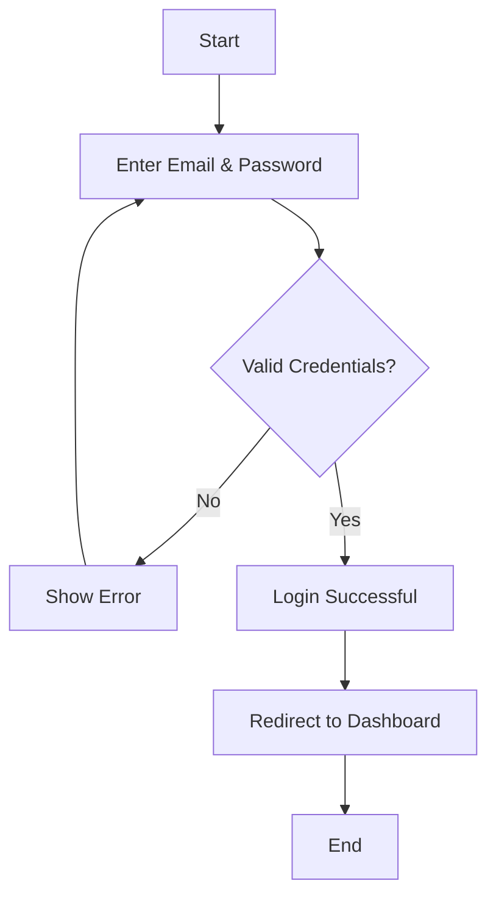
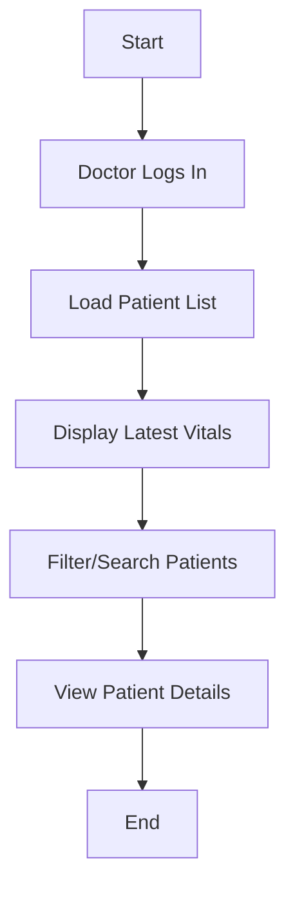
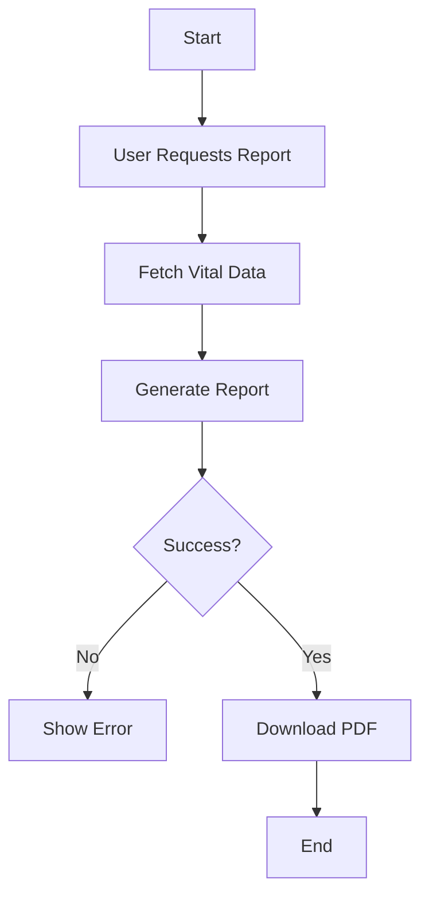
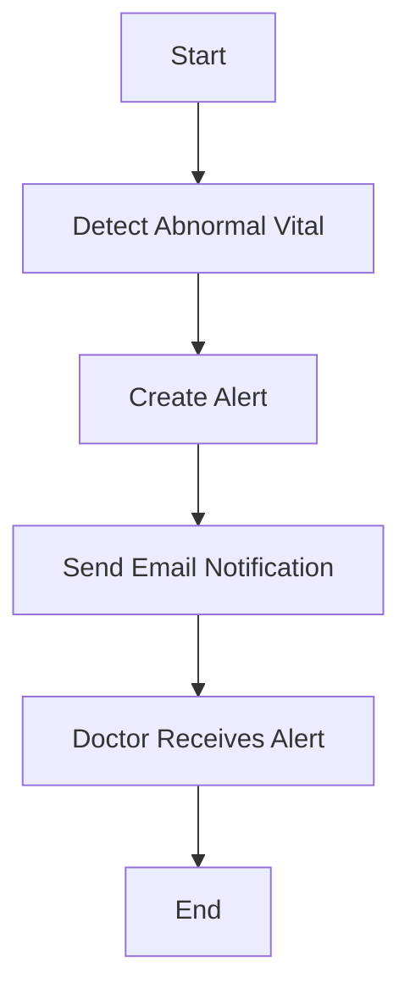
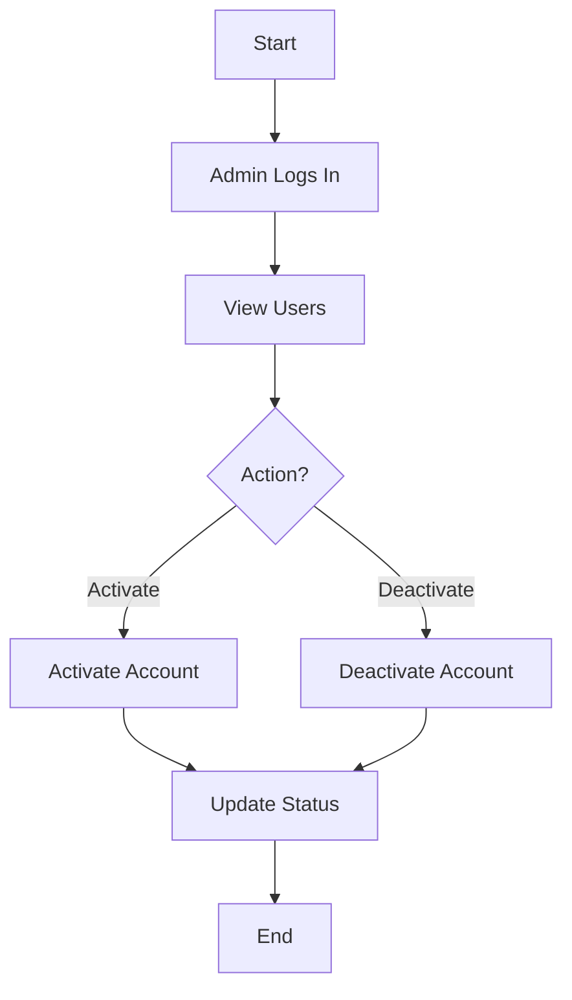
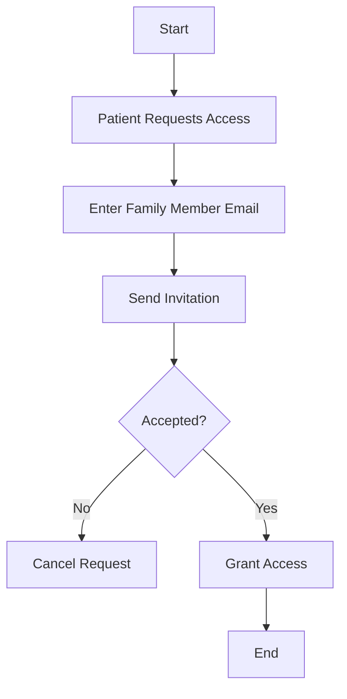

```mermaid
flowchart TD
    A[Start] --> B[Enter Details]
    B --> C{Valid Input?}

    C -- No --> D[Show Error]
    D --> B

    C -- Yes --> E[Create Account]
    E --> F[Send Verification Email]
    F --> G[End]
```

```mermaid
flowchart TD
    A[Start] --> B[Enter Vital Signs]
    B --> C{Valid Data?}

    C -- No --> D[Show Error]
    D --> B

    C -- Yes --> E[Save Data]
    E --> F[Check Thresholds]

    F --> G{Abnormal?}

    G -- Yes --> H[Trigger Alert]
    G -- No --> I[Store as Normal]

    H --> J[End]
    I --> J
```

```mermaid
    flowchart TD
    A[Start] --> B[Enter Email & Password]
    B --> C{Valid Credentials?}

    C -- No --> D[Show Error]
    D --> B

    C -- Yes --> E[Login Successful]
    E --> F[Redirect to Dashboard]
    F --> G[End]
```

```mermaid
flowchart TD
    A[Start] --> B[Doctor Logs In]
    B --> C[Load Patient List]
    C --> D[Display Latest Vitals]
    D --> E[Filter/Search Patients]
    E --> F[View Patient Details]
    F --> G[End]
```

```mermaid
flowchart TD
    A[Start] --> B[User Requests Report]
    B --> C[Fetch Vital Data]
    C --> D[Generate Report]

    D --> E{Success?}

    E -- No --> F[Show Error]
    E -- Yes --> G[Download PDF]

    G --> H[End]
```

```mermaid
flowchart TD
    A[Start] --> B[Detect Abnormal Vital]
    B --> C[Create Alert]
    C --> D[Send Email Notification]
    D --> E[Doctor Receives Alert]
    E --> F[End]
```

```mermaid
flowchart TD
    A[Start] --> B[Admin Logs In]
    B --> C[View Users]
    C --> D{Action?}

    D -- Activate --> E[Activate Account]
    D -- Deactivate --> F[Deactivate Account]

    E --> G[Update Status]
    F --> G

    G --> H[End]

```

```mermaid
flowchart TD
    A[Start] --> B[Patient Requests Access]
    B --> C[Enter Family Member Email]
    C --> D[Send Invitation]
    D --> E{Accepted?}

    E -- No --> F[Cancel Request]
    E -- Yes --> G[Grant Access]

    G --> H[End]
```
    

    
