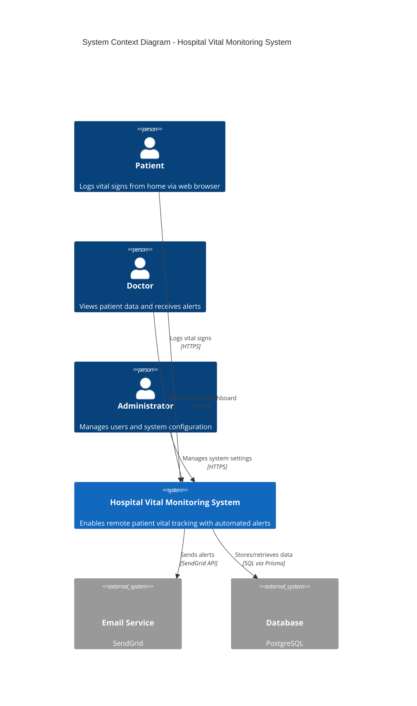
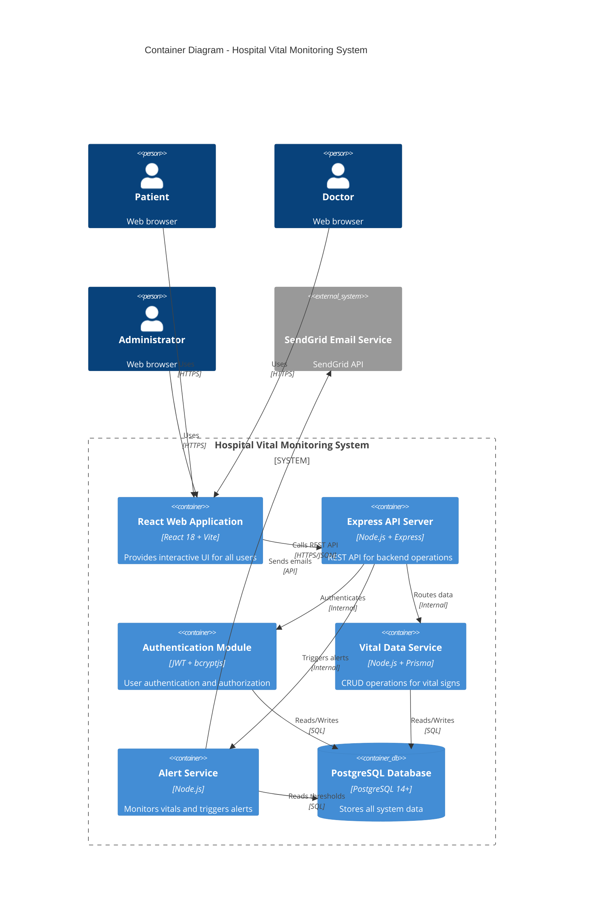
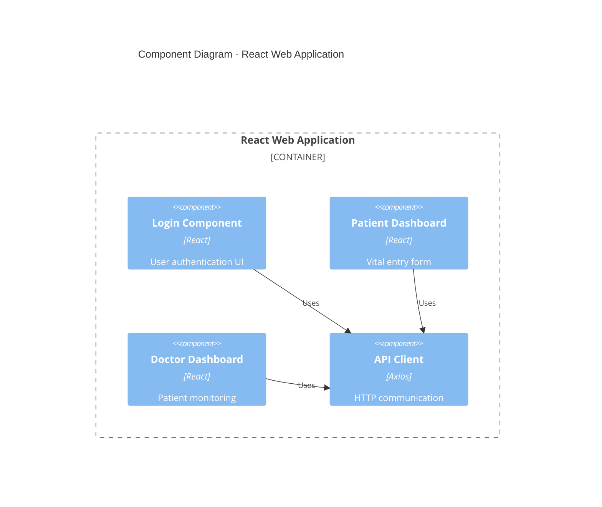
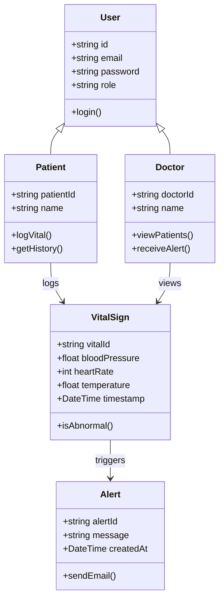
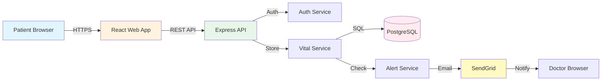

# 🏗️ System Architecture Document

## 1. Introduction

### Project Title
**Hospital Vital Monitoring System**

### Domain
**Healthcare / Hospital - Remote Patient Monitoring**

The healthcare domain involves managing patient health data, enabling communication between patients and healthcare providers, and ensuring timely medical interventions. This system focuses on the **remote patient monitoring** sub-domain within the hospital/healthcare sector, which is increasingly important for chronic disease management (hypertension, diabetes, heart disease), post-operative care, and reducing hospital readmissions.

In this domain, patients require regular monitoring of vital signs (blood pressure, heart rate, temperature, weight), but frequent hospital visits are inconvenient, costly, and time-consuming. Healthcare providers need real-time visibility into patient vitals between appointments to enable timely interventions for abnormal readings.

### Problem Statement
Patients with chronic conditions require regular vital sign monitoring, but frequent hospital visits are inconvenient, costly, and time-consuming. Healthcare providers lack real-time visibility into patient vitals between appointments, which can lead to delayed interventions for abnormal readings and potentially serious health complications.

**This system enables:**
- Patients to log vital signs from home via a web interface
- Doctors to view patient data through an interactive dashboard
- Automated email alerts when vitals exceed safe thresholds
- Health reports for tracking patient progress over time
- Reduced unnecessary hospital visits while improving patient outcomes

### Individual Scope
This project is feasible for individual development over one semester because:

| Factor | Justification |
|--------|---------------|
| **Scope** | Focused on ONE workflow: vital signs monitoring (not full EHR system) |
| **Users** | Two primary roles: Patient and Doctor (manageable complexity) |
| **Technology** | Uses standard web technologies (Node.js, React, PostgreSQL) |
| **Data** | Manual data entry only (no medical device integration required) |
| **Infrastructure** | Free/educational tier cloud services (Render, Supabase, SendGrid) |
| **Time** | Incremental development: auth → data entry → dashboard → alerts → reports |

**Out of Scope (This Semester):**
- ❌ Medical device integration (automated vital capture)
- ❌ Full Electronic Health Records (EHR) system
- ❌ Billing and insurance processing
- ❌ Mobile application (web-first approach)
- ❌ Multi-hospital deployment

**Minimum Viable Product (MVP):**
1. User authentication (patient/doctor roles)
2. Patient vital entry form (BP, heart rate, temperature, weight)
3. Doctor dashboard showing patient list and recent vitals
4. Email alerts for abnormal readings
5. Basic vital history view

---

## 2. C4 Level 1: Context Diagram

The Context Diagram shows the system as a single box and its relationships with external actors and systems.

## 2. C4 Level 2: Container Diagram

## 2. C4 Level 3: Component Diagram

## 2. C4 Level 4: Class Diagram

## 2. C4 Level 5: Flowchart Diagram

