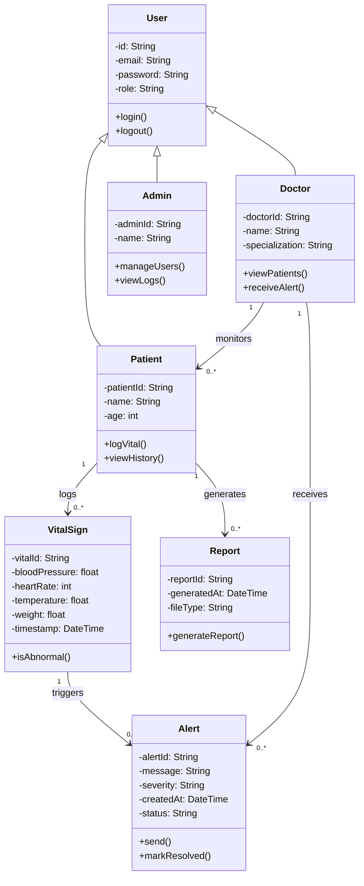

# Class Diagram – Hospital Vital Monitoring System

# 🧠 3. CLASS DIAGRAM EXPLANATION

## Explanation

The class diagram represents the structure of the Hospital Vital Monitoring System.

The **User** class is the base class, with **Patient**, **Doctor**, and **Admin** inheriting from it. This supports role-based functionality.

The **Patient** class is responsible for logging and viewing vital signs, while the **Doctor** class monitors patients and receives alerts.

The **VitalSign** class stores health data and includes logic to determine abnormal readings. When abnormal values are detected, an **Alert** is created and sent to the doctor.

The **Report** class allows patients to generate health summaries over time.

Relationships such as one-to-many between Patient and VitalSign reflect real-world scenarios where a patient can have multiple health records.

This design aligns with functional requirements, use cases, and behavioral diagrams developed in previous assignments.
