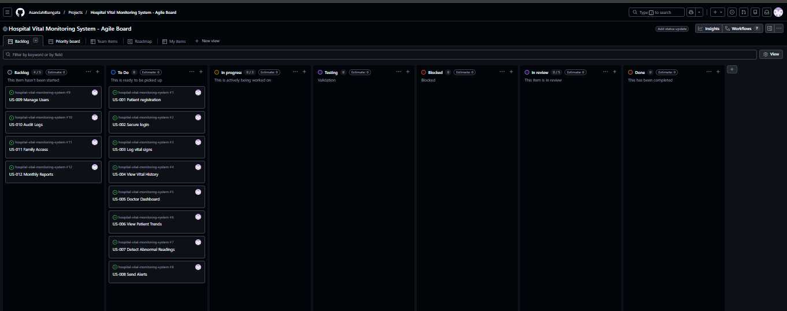
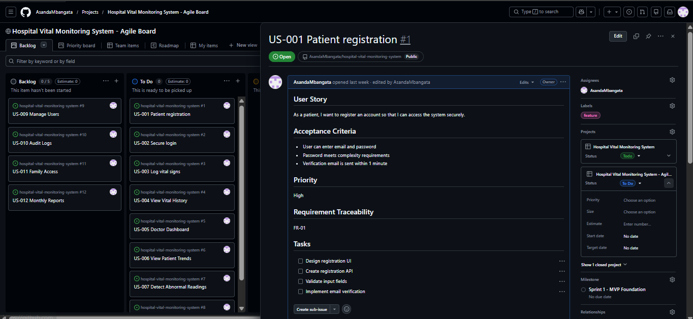

# Hospital Vital Monitoring System

## Introduction

**Hospital Vital Monitoring System**
The goal of this system is to provide a simple platform for monitoring patient vital signs remotely and allowing healthcare providers to track patient health data more effectively.

---

## What This System Will Do

Once completed, this system will enable:

- **Patients** to register and log their vital signs  
  (blood pressure, heart rate, temperature, weight)

- **Doctors** to view patient data through an interactive dashboard

- **Automated alerts** when vital signs exceed safe thresholds

- **Health reports** for tracking patient progress over time

This helps reduce unnecessary hospital visits while still allowing doctors to monitor patient health.

---

## Project Structure

| File | Description |
|-----|-------------|
| `README.md` | Project overview and navigation |
| `SPECIFICATION.md` | Complete system specification document |
| `ARCHITECTURE.md` | C4 architectural diagrams |
| `STAKEHOLDERS.md` | Stakeholder analysis |
| `REQUIREMENTS.md` | Functional and non-functional requirements |
| `USE_CASE_AND_TEST_DOCUMENT.md` | Assignment 5: Use cases and test cases |
| `AGILE_PLANNING_DOCUMENT.md` | Assignment 6: Agile planning |
| `REFLECTION.md` | Assignment 4 reflection |
| `TEMPLATE_ANALYSIS.md` | Assignment 7: Template comparison and selection |
| `KANBAN_EXPLANATION.md` | Assignment 7: Kanban explanation |
| `REFLECTION_ASSIGNMENT7.md` | Assignment 7: Reflection |
| `src/` | Source code (to be developed later) |
| `docs/` | Additional documentation |

---

## Documentation

-  [System Specification](SPECIFICATION.md)  
-  [System Architecture](ARCHITECTURE.md)
-  [Stakeholder Analysis](STAKEHOLDERS.md)
-  [System Requirements](REQUIREMENTS.md)
-  [Use Case & Test Document](USE_CASE_AND_TEST_DOCUMENT.md)
-  [Reflection](REFLECTION.md)
-  [Agile Planning](AGILE_PLANNING_DOCUMENT.md)
-  [Template Analysis](TEMPLATE_ANALYSIS.md)
-  [Kanban Explanation](KANBAN_EXPLANATION.md)
-  [Reflection](REFLECTION.md)
-  [Assignment_7_Reflection ](REFLECTION_ASSIGNMENT7.md)

---

## Development Status

| Phase | Status |
|------|--------|
| Specification | ✅ Complete |
| Architecture | ✅ Complete |
| Development | 🔄 In Progress |
| Testing | ⏳ Pending |
| Deployment | ⏳ Pending |

---

## Planned Technologies

The following technologies may be used during development:

- **Frontend:** React  
- **Backend:** Node.js / Express  
- **Database:** PostgreSQL  
- **Authentication:** JWT  
- **Version Control:** GitHub

## Kanban Board (Assignment 7)

The Kanban board was created using GitHub Projects to support Agile workflow management and task tracking.

### Customization Choices

The board was customized to better reflect a real-world software development workflow:

- **Backlog**: Stores all identified tasks that are not yet prioritized  
- **To Do**: Tasks selected for the current sprint  
- **In Progress**: Tasks currently being developed  
- **Testing**: Added to ensure features are validated before completion  
- **Blocked**: Added to identify tasks that cannot proceed due to dependencies or issues  
- **In Review**: Tasks being reviewed before completion  
- **Done**: Completed tasks  

Additional columns such as **Testing** and **Blocked** were introduced to improve workflow visibility and align with Agile practices.

### Task Management

- User stories from Assignment 6 were added as GitHub Issues  
- Issues were labeled using `feature` 
- Tasks were assigned using GitHub’s assignment feature  
- The board visually tracks task progress across all stages  

### Screenshot

---

## Author

**Asanda Mbangata**
