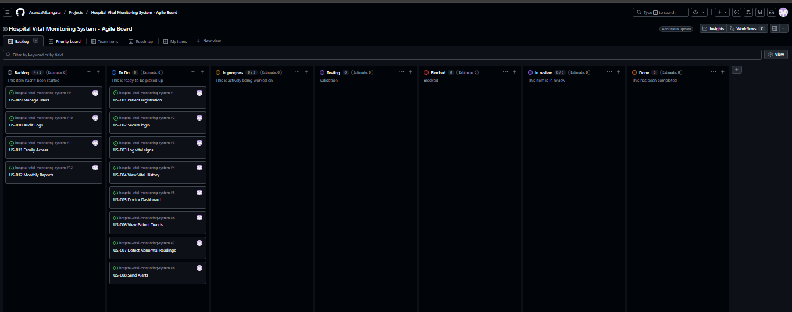
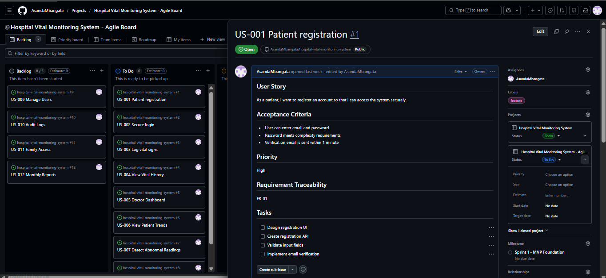
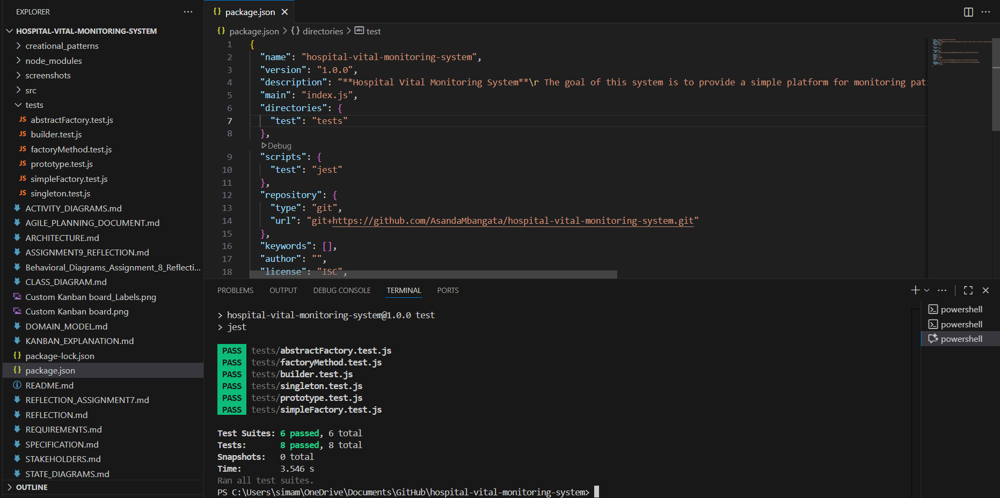
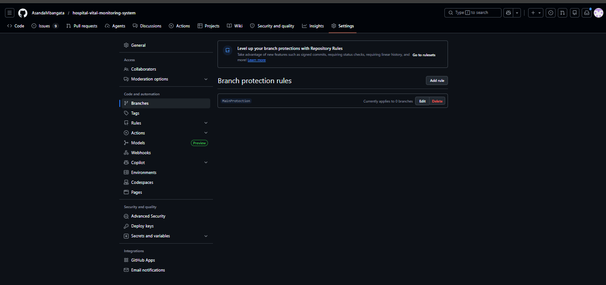
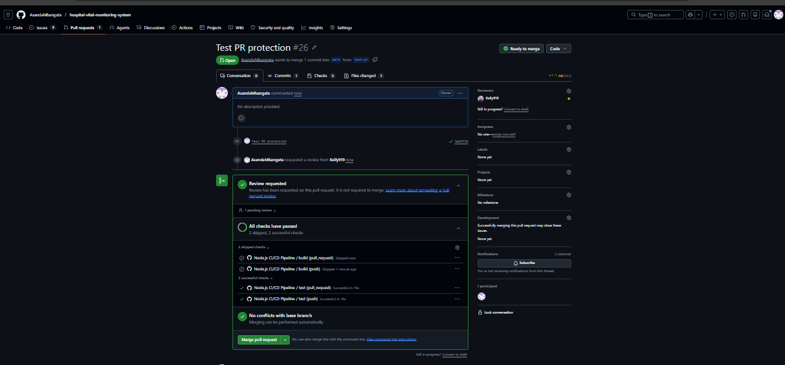
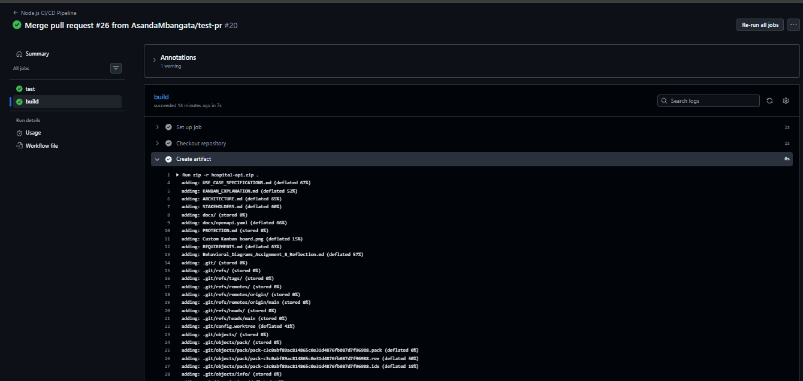
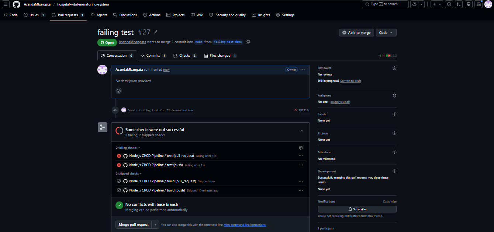
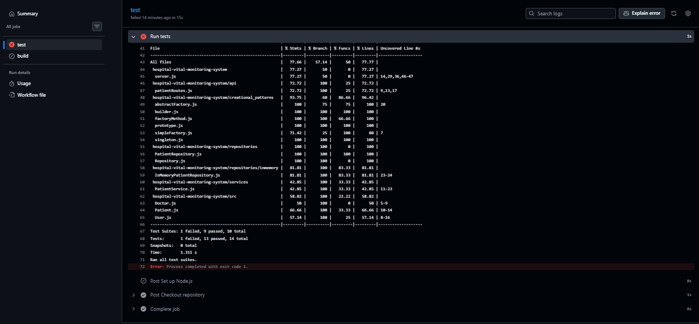

# Hospital Vital Monitoring System

## Introduction

**Hospital Vital Monitoring System**
The goal of this system is to provide a simple platform for monitoring patient vital signs remotely and allowing healthcare providers to track patient health data more effectively.

---

## Table of Contents

- [Introduction](#introduction)
- [What This System Will Do](#what-this-system-will-do)
- [Project Structure](#project-structure)
- [Documentation](#documentation)
- [Development Status](#development-status)
- [Planned Technologies](#planned-technologies)
- [Kanban Board](#kanban-board-assignment-7)
- [Design Decisions](#design-decisions-assignment-10)
- [Repository Layer](#repository-layer-assignment-11)
- [REST API](#rest-api-assignment-12)
- [CI/CD](#assignment-13--cicd-with-github-actions)
- [Getting Started](#getting-started)
- [Features for Contribution](#features-for-contribution)
- [Author](#author)

## What This System Will Do

Once completed, this system will enable:

- **Patients** to register and log their vital signs  
  (blood pressure, heart rate, temperature, weight)

- **Doctors** to view patient data through an interactive dashboard

- **Automated alerts** when vital signs exceed safe thresholds

- **Health reports** for tracking patient progress over time

This helps reduce unnecessary hospital visits while still allowing doctors to monitor patient health.

---

## Project Structure

| File | Description |
|-----|-------------|
| `README.md` | Project overview and navigation |
| `SPECIFICATION.md` | Complete system specification document |
| `ARCHITECTURE.md` | C4 architectural diagrams |
| `STAKEHOLDERS.md` | Stakeholder analysis |
| `REQUIREMENTS.md` | Functional and non-functional requirements |
| `USE_CASE_AND_TEST_DOCUMENT.md` | Assignment 5: Use cases and test cases |
| `AGILE_PLANNING_DOCUMENT.md` | Assignment 6: Agile planning |
| `REFLECTION.md` | Assignment 4 reflection |
| `TEMPLATE_ANALYSIS.md` | Assignment 7: Template comparison and selection |
| `KANBAN_EXPLANATION.md` | Assignment 7: Kanban explanation |
| `REFLECTION_ASSIGNMENT7.md` | Assignment 7: Reflection |
| `STATE_DIAGRAMS.md` | Assignment 8: State Diagrams |
| `ACTIVITY DIAGRAMS.md` | Assignment 8: Activity Diagrams |
| `Behavioral_Diagrams_Assignment 8_Reflection.md` | Assignment 8: Reflection |
| `DOMAIN_MODEL.md` | Assignment 9: Domain Model |
| `CLASS_DIAGRAM.md` | Assignment 9: Class Diagram |
| `ASSIGNMENT9_REFLECTION.md` | Assignment 9: Reflection |
| `CHANGELOG.md` | Assignment 10: Change Log |
| `src/` | Core system class implementations (Assignment 10) |
| `creational_patterns/` | Implementation of all six creational design pattern |
| `tests/` | Jest unit tests validating object creation |
| `docs/openapi.yaml` |  |
| `PROTECTION.md` | Assignment 13: Branch Protection |

---

## Documentation

-  [System Specification](SPECIFICATION.md)  
-  [System Architecture](ARCHITECTURE.md)
-  [Stakeholder Analysis](STAKEHOLDERS.md)
-  [System Requirements](REQUIREMENTS.md)
-  [Use Case & Test Document](USE_CASE_AND_TEST_DOCUMENT.md)
-  [Reflection](REFLECTION.md)
-  [Agile Planning](AGILE_PLANNING_DOCUMENT.md)
-  [Template Analysis](TEMPLATE_ANALYSIS.md)
-  [Kanban Explanation](KANBAN_EXPLANATION.md)
-  [Assignment_7_Reflection ](REFLECTION_ASSIGNMENT7.md)
-  [State Diagrams ](STATE_DIAGRAMS.md)
-  [Activity_Diagrams ](ACTIVITY_DIAGRAMS.md)
-  [Assignment_8_Reflection ](Behavioral_Diagrams_Assignment_8_Reflection.md)
-  [Domain Model ](DOMAIN_MODEL.md)
-  [Class Diagram ](CLASS_DIAGRAM.md)
-  [Change Log ](CHANGELOG.md)
-  [Branch Protection ](PROTECTION.md)


---

## Development Status

| Phase | Status |
|------|--------|
| Specification | ✅ Complete |
| Architecture | ✅ Complete |
| Development | 🔄 In Progress |
| Testing | ⏳ Pending |
| Deployment | ⏳ Pending |

---

## Planned Technologies

The following technologies may be used during development:

- **Frontend:** React  
- **Backend:** Node.js / Express  
- **Database:** PostgreSQL  
- **Authentication:** JWT  
- **Version Control:** GitHub

## Kanban Board (Assignment 7)

The Kanban board was created using GitHub Projects to support Agile workflow management and task tracking.

### Customization Choices

The board was customized to better reflect a real-world software development workflow:

- **Backlog**: Stores all identified tasks that are not yet prioritized  
- **To Do**: Tasks selected for the current sprint  
- **In Progress**: Tasks currently being developed  
- **Testing**: Added to ensure features are validated before completion  
- **Blocked**: Added to identify tasks that cannot proceed due to dependencies or issues  
- **In Review**: Tasks being reviewed before completion  
- **Done**: Completed tasks  

Additional columns such as **Testing** and **Blocked** were introduced to improve workflow visibility and align with Agile practices.

### Task Management

- User stories from Assignment 6 were added as GitHub Issues  
- Issues were labeled using `feature` 
- Tasks were assigned using GitHub’s assignment feature  
- The board visually tracks task progress across all stages  

### Screenshots

#### Kanban Board


#### Labels



## Design Decisions (Assignment 10)

This system implements multiple creational design patterns to improve flexibility, maintainability, and scalability:

- Simple Factory: Used to create different types of users (Patient, Doctor) through a centralized creation method.
- Factory Method: Used to generate different alert types (e.g., Email and SMS alerts) without modifying existing code.
- Abstract Factory: Used to create related UI components (e.g., web and mobile interfaces) in a consistent way.
- Builder: Used to construct VitalSign objects step-by-step, allowing flexible creation of complex data.
- Prototype: Used to clone existing vital records efficiently without reinitializing objects.
- Singleton: Used to ensure only one instance of the database connection exists throughout the system.

These patterns were selected to demonstrate different object creation strategies while improving code organization, reusability, and scalability.

### Coverage Report

Test coverage was generated using Jest, confirming that all creational patterns are tested.




## Repository Layer (Assignment 11)

A repository layer was implemented to separate business logic from storage logic.

### Design Choices

- Generic repository interfaces were used to reduce code duplication.
- An in-memory repository implementation was created using JavaScript Map storage.
- The Factory Pattern was used to switch between repository implementations.
- A future database repository stub was added to support scalability and future persistence options.

### Benefits

- Improved separation of concerns
- Easier testing using in-memory repositories
- Future support for databases and external storage systems

  ### Example API Response

GET /api/patients

```json
{
  "message": "Fetch all patients"
}
```

## REST API (Assignment 12)

The Hospital Vital Monitoring System exposes RESTful API endpoints using Express.js.

### Endpoints

| Method | Endpoint | Description |
|----------|----------|----------|
| GET | /api/patients | Retrieve all patients |
| GET | /api/patients/:id | Retrieve a patient by ID |
| POST | /api/patients | Create a patient |
| PUT | /api/patients/:id | Update a patient |
| DELETE | /api/patients/:id | Delete a patient |

### API Documentation

Swagger UI:

`http://localhost:3000/docs`

The OpenAPI specification is stored in:

docs/openapi.yaml

## Assignment 13 – CI/CD with GitHub Actions

## Continuous Integration and Continuous Deployment (CI/CD)

This project uses GitHub Actions to automate testing and artifact generation.

The CI/CD pipeline helps ensure that:
- All code changes are tested automatically
- Pull requests are reviewed before merging
- Broken code cannot be merged into the `main` branch
- Release artifacts are generated automatically

---

## Branch Protection Rules

Branch protection rules were configured for the `main` branch to improve code quality and maintain project stability.

### Rules Applied
- Require pull request reviews before merging
- Require at least one approval review
- Require status checks to pass before merging
- Prevent direct pushes to the `main` branch
- Block force pushes

These protections help ensure that all code is reviewed and tested before deployment.

---

## CI Pipeline Features

The GitHub Actions workflow automatically:

- Runs on every push
- Runs on every pull request targeting `main`
- Installs project dependencies
- Executes all unit and integration tests using Jest

### Workflow File

## Testing

Testing is implemented using Jest.

The project includes:

- Unit tests
- Repository tests
- API endpoint tests
- Service layer tests

Run tests:

npm test

Generate coverage:

npm test -- --coverage

### Workflow File

`.github/workflows/ci.yml`

### CD Pipeline Features

The deployment pipeline automatically:

- Builds a release artifact after successful tests
- Generates a ZIP release package
- Uploads the artifact using GitHub Actions

Generated artifact:
`hospital-api.zip`

Running Tests Locally

Install dependencies:
npm install

Run tests:
npm test

Pull Request Workflow

This project follows a pull request workflow where:

Developers create a feature branch
A pull request is opened against main
GitHub Actions automatically runs tests
Pull requests require approval before merging
Code is merged only after all checks pass

This workflow improves software quality and supports modern DevOps practices.

```









## Author

**Asanda Mbangata**
