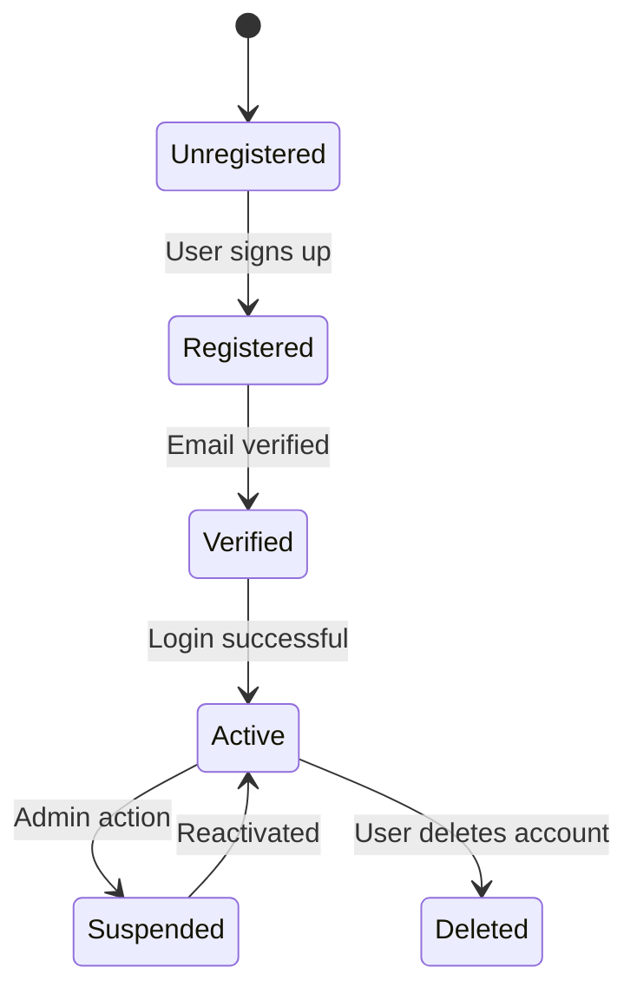
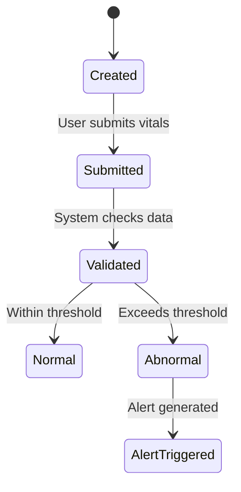
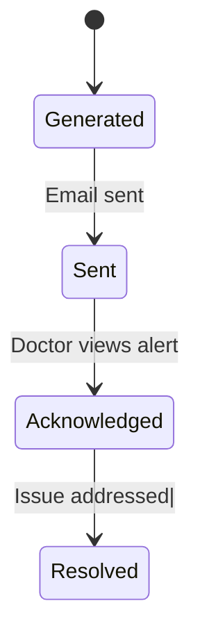
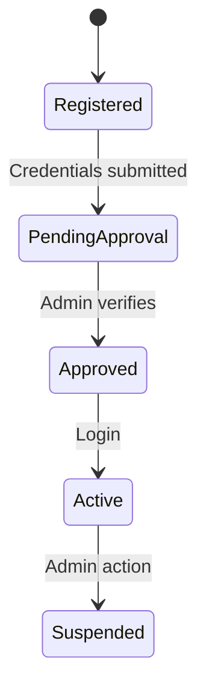
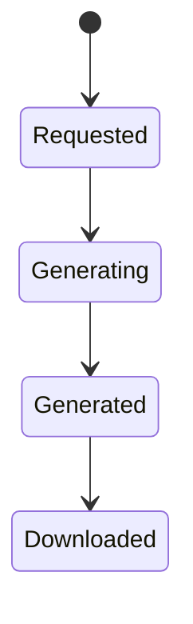
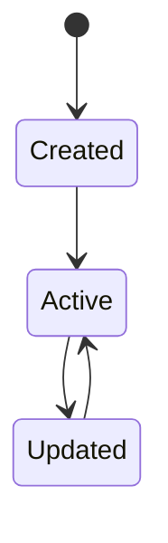

### User Account State Diagram



### User Account State Diagram Explanation

The User Account object transitions from Unregistered to Registered when a user signs up (FR-01). After email verification, the account becomes Verified and can move to Active upon successful login.

Administrative actions allow accounts to be Suspended or reactivated. Users may also delete their accounts, transitioning to the Deleted state.

This diagram supports:
- FR-01: Patient registration
- FR-09: Admin account management











```mermaid
stateDiagram-v2
    [*] --> Requested

    Requested --> Granted
    Granted --> Revoked
 ```
 
