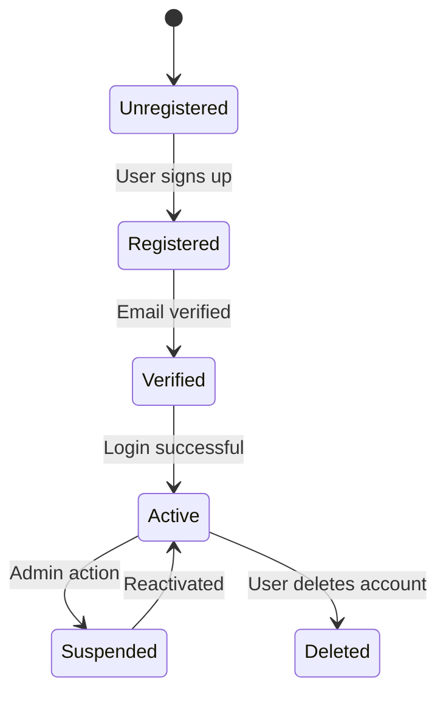
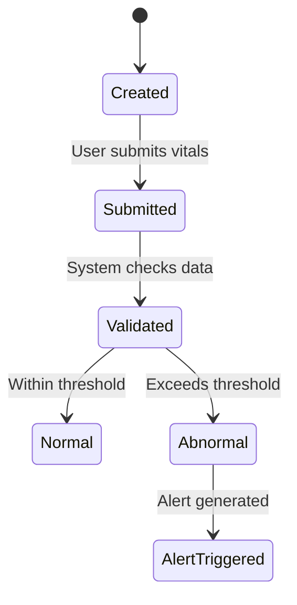
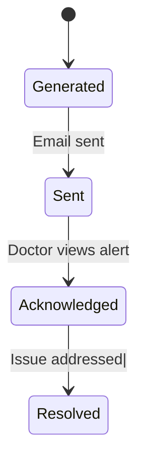
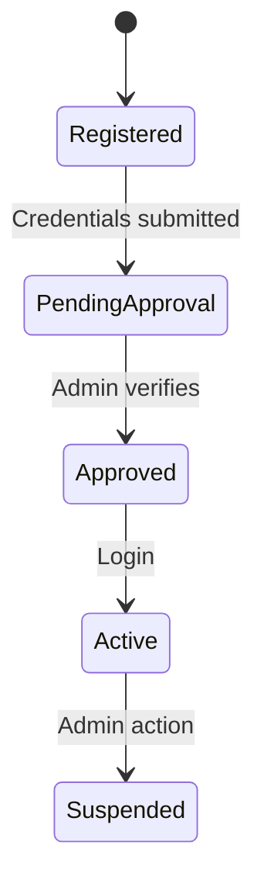
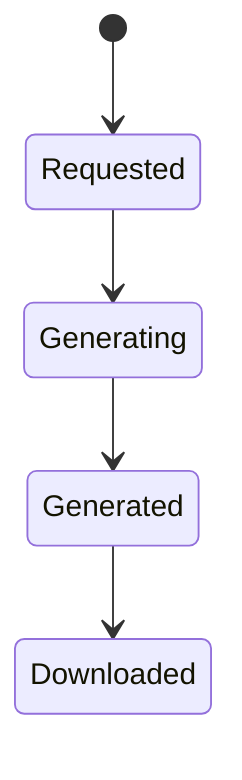
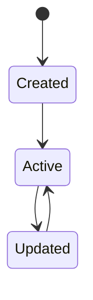

### User Account State Diagram



### User Account State Diagram Explanation

The User Account object transitions from Unregistered to Registered when a user signs up (FR-01). After email verification, the account becomes Verified and can move to Active upon successful login.

Administrative actions allow accounts to be Suspended or reactivated. Users may also delete their accounts, transitioning to the Deleted state.

This diagram supports:
- FR-01: Patient registration
- FR-09: Admin account management

### Vital Sign Record State Diagram


### Vital Sign Record State Diagram Explanation

The Vital Sign Record begins in the Created state when a patient enters data. After submission, the system validates the input.

If values are within safe thresholds, the record is classified as Normal. If values exceed thresholds, it transitions to Abnormal and triggers an alert.

This diagram supports:
- FR-02: Log vital signs
- FR-07: Detect abnormal readings

### Alert State Diagram

### Alert State Diagram Explanation

An Alert is generated when abnormal vital signs are detected. The system sends the alert via email to the doctor.

Once the doctor views the alert, it becomes Acknowledged, and after appropriate action is taken, it transitions to Resolved.

This diagram supports:
- FR-07: Abnormal detection
- FR-08: Alert notifications

### Doctor Account State Diagram

### Doctor Account State Diagram Explanation

A Doctor Account is initially Registered and moves to Pending Approval after credentials are submitted. Once verified by an administrator, the account becomes Approved.

The doctor can then log in and become Active. Admins may suspend accounts if necessary.

This diagram supports:
- FR-04: Doctor registration and verification
- FR-09: Admin control over accounts

## Report State Diagram


### Report State Diagram Explanation

A Report is created when a user requests it. The system processes the request and generates the report.

Once generated, the report becomes available for download by the user.

This diagram supports:
- FR-12: Generate monthly health reports

### Patient Profile State Diagram

 ### Patient Profile State Diagram Explanation

The Patient Profile is created during registration and becomes Active. Users can update their profile information, transitioning to Updated, and then return to Active.

This diagram supports:
- FR-01: User registration
- Profile management functionality

### Access Permission State Diagram
```mermaid
stateDiagram-v2
    [*] --> Requested

    Requested --> Granted
    Granted --> Revoked
 ```
### Access Permission State Diagram Explanation

Access Permission begins when a patient requests to grant access to a family member. If approved, access is Granted.

Patients can revoke access at any time, transitioning the state to Revoked.

This diagram supports:
- FR-11: Grant/revoke family access
 
