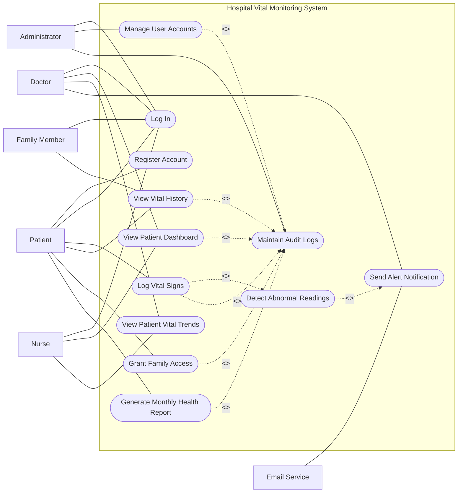

# 🎯 Use Case Modeling

## Project: Hospital Vital Monitoring System

This document contains use case diagrams and detailed specifications for the Hospital Vital Monitoring System.

---

## 1. Use Case Diagram

Actors and roles

Patient
The patient is the main end-user of the system. Patients register, log in, enter vital signs, view their history, grant access to family members, and generate monthly health reports.

Doctor
Doctors log in to monitor assigned patients, view dashboards, inspect patient vital trends, and receive abnormal vital alerts.

Nurse
Nurses support doctors by viewing patient dashboards and vital trends to help prioritize care and monitor patient status.

Administrator
Administrators manage user accounts, approve or deactivate users, and review audit logs for accountability and compliance.

Family Member
Family members can access patient health information only after the patient grants permission.

Email Service
This is an external supporting actor. It is used by the system to deliver alert notifications when abnormal readings are detected.

Relationships between actors and use cases

The diagram shows direct associations between actors and the use cases they perform. It also uses <<include>> relationships for compulsory sub-processes:

Log Vital Signs includes Detect Abnormal Readings because every submitted reading must be checked.
Detect Abnormal Readings includes Send Alert Notification because critical or warning cases trigger alerts.
Manage User Accounts includes Maintain Audit Logs because admin actions must be recorded.
Several important actions include Maintain Audit Logs to support compliance and traceability.
How the diagram addresses stakeholder concerns

This diagram reflects the stakeholder needs identified in Assignment 4:

Patients need easy registration, vital entry, history viewing, and report generation.
Doctors need dashboards, trends, and alerts for fast intervention.
Nurses need quick visibility into patient status.
Administrators need user control and audit logging.
Family members need limited, consent-based access.
IT and compliance stakeholders need audit trails and structured alert handling.

So the diagram stays aligned with your functional requirements and stakeholder analysis.
