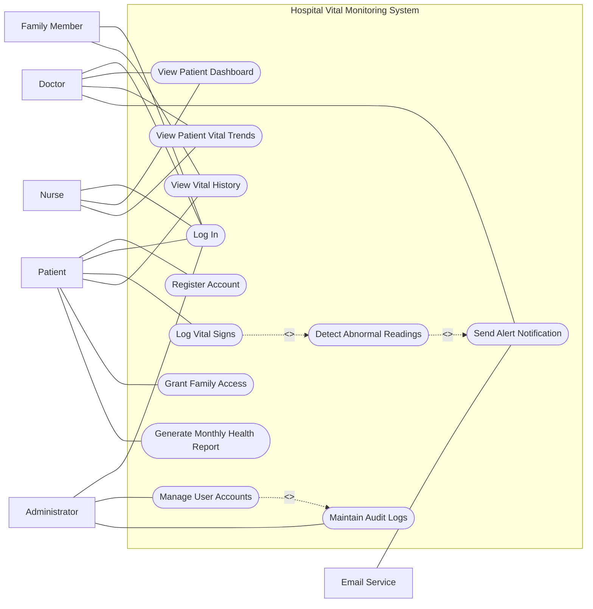

# Assignment 5: Use Case Modeling and Test Case Development

## Hospital Vital Monitoring System

This document is derived from the stakeholder analysis, system requirements, and architecture defined in Assignments 3 and 4. It presents the use case model and test cases that validate system behavior.

---

## 1. Use Case Diagram

---

## 2. Use Case Explanation

The system includes six main actors: Patient, Doctor, Nurse, Administrator, Family Member, and Email Service.

Patients interact with the system by registering, logging in, entering vital signs, viewing history, and generating reports. Doctors and nurses monitor patient data through dashboards and receive alerts when abnormal readings occur. Administrators manage user accounts and ensure system compliance through audit logs. Family members are granted limited access by patients, while the Email Service supports alert notifications.

The diagram uses `<<include>>` relationships to show required internal processes. For example, logging vital signs always includes detecting abnormal readings, which may trigger alerts. Administrative actions also include audit logging to ensure compliance and traceability.

This model reflects stakeholder needs from Assignment 4 by supporting usability for patients, real-time monitoring for doctors, system control for administrators, and secure, auditable processes for regulatory requirements.

---

## 3. Use Case Specifications

### UC-01 Register Account

**Actor:** Patient
**Precondition:** User is not registered
**Postcondition:** Account created

**Basic Flow:**

1. Enter details
2. Validate input
3. Create account
4. Send verification email

**Alternative:** Invalid input or duplicate email

---

### UC-02 Log In

**Actor:** All users
**Precondition:** Account exists
**Postcondition:** User logged in

**Basic Flow:**

1. Enter credentials
2. Validate
3. Redirect

**Alternative:** Invalid login

---

### UC-03 Log Vital Signs

**Actor:** Patient
**Precondition:** Logged in
**Postcondition:** Data stored

**Basic Flow:**

1. Enter vitals
2. Submit
3. Validate
4. Save
5. Check abnormal

---

### UC-04 View Vital History

**Actor:** Patient
**Precondition:** Logged in
**Postcondition:** Data displayed

**Basic Flow:**

1. Open history
2. Filter
3. Display

---

### UC-05 View Dashboard

**Actor:** Doctor/Nurse
**Precondition:** Logged in
**Postcondition:** Patients displayed

**Basic Flow:**

1. Open dashboard
2. View patients
3. Filter/search

---

### UC-06 View Trends

**Actor:** Doctor/Nurse
**Precondition:** Patient selected
**Postcondition:** Charts shown

---

### UC-07 Detect Abnormal Readings

**Actor:** System
**Precondition:** Vital submitted
**Postcondition:** Alert triggered if needed

---

### UC-08 Manage Users

**Actor:** Admin
**Precondition:** Logged in
**Postcondition:** User updated

---

## 4. Test Case Development

### 4.1 Functional Test Cases

| ID     | Requirement | Description     | Steps                  | Expected Result | Status |
| ------ | ----------- | --------------- | ---------------------- | --------------- | ------ |
| TC-001 | FR-01       | Register user   | Enter details          | Account created | TBD    |
| TC-002 | FR-01       | Weak password   | Enter invalid password | Error shown     | TBD    |
| TC-003 | FR-02       | Log vitals      | Enter vitals           | Success message | TBD    |
| TC-004 | FR-03       | View history    | Open page              | Data displayed  | TBD    |
| TC-005 | FR-05       | View dashboard  | Login doctor           | Patients shown  | TBD    |
| TC-006 | FR-06       | View trends     | Select patient         | Chart displayed | TBD    |
| TC-007 | FR-07       | Detect abnormal | Submit abnormal value  | Alert triggered | TBD    |
| TC-008 | FR-09       | Manage users    | Admin updates user     | User updated    | TBD    |

---

### 4.2 Non-Functional Test Cases

| ID      | Requirement | Description          | Expected           |
| ------- | ----------- | -------------------- | ------------------ |
| NFTC-01 | Performance | 1000 users load test | ≤3 sec response    |
| NFTC-02 | Security    | Login protection     | Secure + encrypted |

---

## 5. Traceability to Assignment 4

All use cases and test cases are derived from Assignment 4 requirements.

* Functional requirements (FR-01 to FR-12) are validated through test cases
* Non-functional requirements (performance, security, scalability) are tested
* Stakeholder needs are reflected in system interactions

This ensures alignment between requirements, design, and testing.

---

## 6. Reflection
**Reflection: Challenges in Translating Requirements into Use Cases and Tests**

Translating the stakeholder and system requirements of the Hospital Vital Monitoring System into use cases and test cases revealed that requirements engineering is not only about identifying what a system should do, but also about expressing that behavior in a structured, testable form. One major challenge was turning broad stakeholder needs into precise system interactions. In Assignment 4, many requirements were written at a higher level, such as “doctors need timely alerts” or “patients need easy data entry.” For Assignment 5, these had to be converted into specific use cases with actors, flows, preconditions, postconditions, and exceptions. This required careful interpretation so that the use cases stayed faithful to the original requirements without becoming too vague.

Another challenge was deciding the correct system boundary. In use case modeling, it is important to show what belongs inside the Hospital Vital Monitoring System and what should remain outside as an actor or external service. For example, the Email Service is not a human user, but it still plays an important role because the system depends on it to deliver alerts. Similarly, family members are not core users of the MVP, but they still appear in the requirements and therefore had to be represented in the model. Defining these boundaries clearly helped keep the diagram aligned with UML thinking.

A further difficulty was identifying include relationships correctly. Not every connected action should be modeled as an included use case. I had to think carefully about which behaviors are always required. For instance, whenever a patient logs vital signs, the system must check for abnormal values, so “Detect Abnormal Readings” is included in “Log Vital Signs.” Likewise, administrative actions must be logged, so “Maintain Audit Logs” is included in account management and other sensitive operations. This helped show internal system behavior more clearly.

Writing use case specifications also showed how much detail is needed to support testing. A use case is not useful if it only describes the happy path. Alternative flows were necessary because real systems must handle invalid input, empty data, failed notifications, and unauthorized access. These exception paths made the model more realistic and directly supported later test case creation.

The transition from requirements to test cases presented another challenge: making requirements measurable. Some requirements already included measurable acceptance criteria, such as response time limits or alert delivery within a specific number of minutes. These were easier to convert into tests. Others, such as usability or helpfulness, were less direct and required interpretation into observable outcomes.

Overall, this assignment showed that use cases act as a bridge between requirements and testing. They help transform stakeholder expectations into clear interactions, and they make it easier to derive test cases that verify whether the system behaves correctly. The process improved consistency across the project and made the system design more practical, testable, and aligned with stakeholder needs.

Additionally, aligning use cases with stakeholder priorities required continuous reference back to the stakeholder analysis to ensure that no critical requirement was overlooked. This process highlighted the importance of traceability between requirements, use cases, and test cases. Maintaining this alignment ensured that each feature developed in the system could be validated against a specific stakeholder need. Overall, this experience strengthened my understanding of how structured modeling techniques contribute to building reliable and user-centered systems
