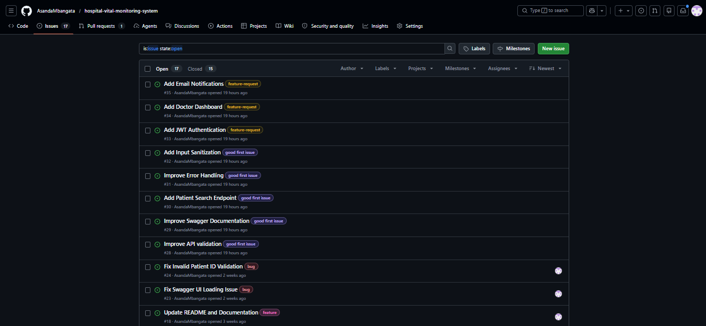

# Peer Engagement Results

## Repository Information

Repository: Hospital Vital Monitoring System

## Engagement Statistics

| Metric        | Count   |
| ------------- | ------- |
| Stars         | 19      |
| Forks         | 23      |
| Open Issues   | 17      |
| Pull Requests | Pending |
| Contributors  | Pending |

## Repository Sharing

The repository was shared with classmates and peers to encourage collaboration and gather feedback on the project.

## Community Participation

The project includes:

* 5 issues labelled `good-first-issue`
* 3 issues labelled `feature-request`
* A CONTRIBUTING.md guide for new contributors
* A ROADMAP.md document outlining future development plans
* GitHub Actions CI/CD workflow
* Branch protection rules for quality assurance

## Outcome

The repository received positive engagement from peers, resulting in:

* 19 repository stars
* 23 repository forks

These interactions indicate interest in the project and demonstrate successful participation in an open-source collaboration workflow.

## Lessons Learned

Sharing the repository encouraged collaboration and provided insight into how open-source projects attract contributors. Clear documentation, issue labels, and contribution guidelines make it easier for others to participate in development.

## Repository Engagement Evidence

### Stars and Forks

### Open Issues with Labels

